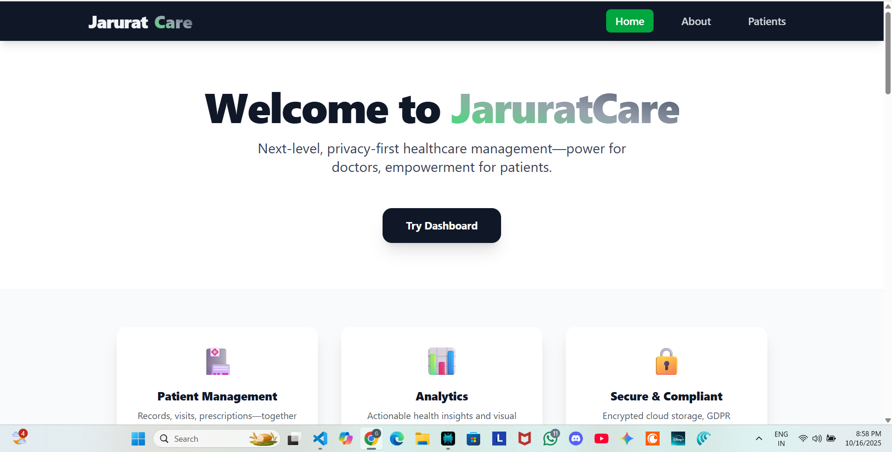
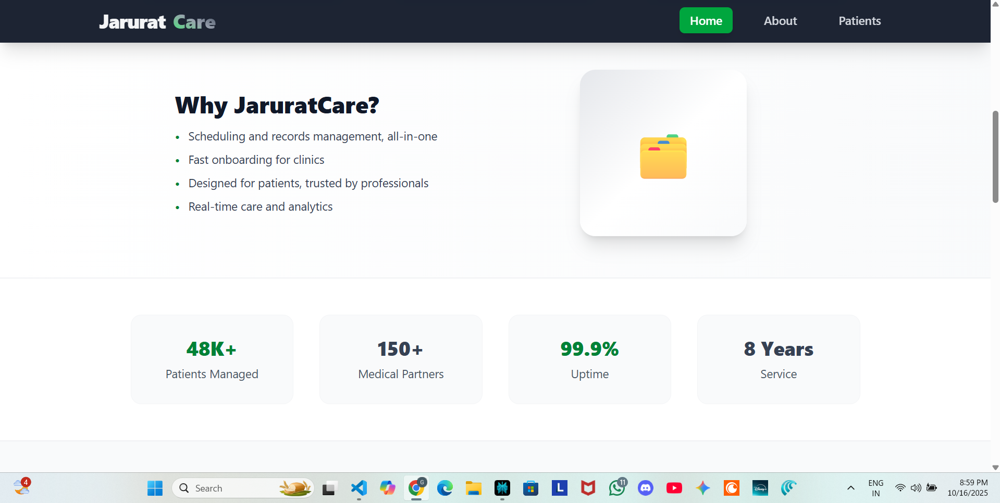
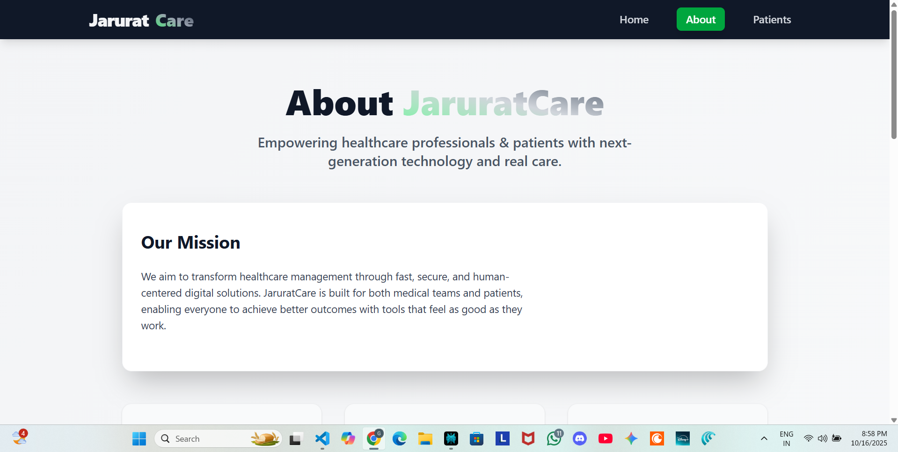
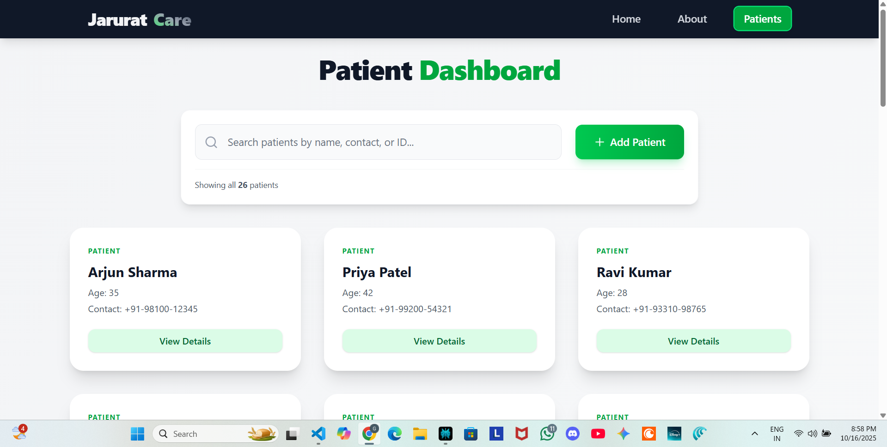
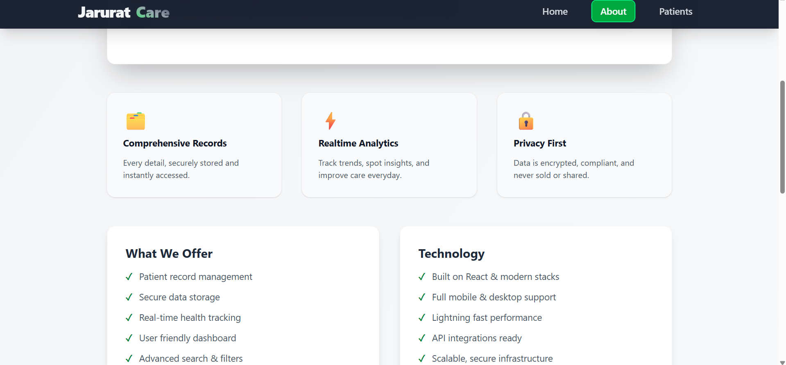

# JaruratCare - Patient Management Dashboard

## 📋 Project Description

JaruratCare is a React-based patient management dashboard that allows users to view, search, and add patient records. The application displays patient information in a clean, responsive interface with search functionality and detailed patient modals.

### 🎯 Key Features

- **Patient Dashboard**: View all patients in a responsive grid layout
- **Search Functionality**: Search patients by name with real-time filtering
- **Add New Patients**: Form to add new patient records with validation
- **Patient Details Modal**: Detailed view of individual patient information
- **Responsive Design**: Works on desktop and mobile devices
- **Sample Data**: Includes 26 sample patient records for demonstration

## 🌐 Live Demo

Check out the deployed application: [https://jarurat-care-jpr5.onrender.com/about](https://jarurat-care-jpr5.onrender.com/about)

## 📸 Screenshots

### Home Page


### About Page


### Patients Dashboard


### Patient Details Modal


### Add Patient Form


## 🏗️ Architecture & Technology Stack

### Frontend Architecture

```
jaruratcare/
├── public/
│   └── vite.svg
├── src/
│   ├── components/
│   │   ├── Navbar.jsx          # Navigation component with responsive menu
│   │   ├── PatientCard.jsx     # Individual patient card display
│   │   └── PatientModal.jsx    # Detailed patient information modal
│   ├── pages/
│   │   ├── Home.jsx            # Landing page with features and testimonials
│   │   ├── About.jsx           # Company information and team details
│   │   └── Patients.jsx        # Patient dashboard with search and management
│   ├── store/
│   │   └── store.js            # Redux store configuration and slices
│   ├── data/
│   │   └── patients.json       # Sample patient data
│   ├── App.jsx                 # Main application component with routing
│   ├── main.jsx                # Application entry point
│   └── index.css               # Global styles and Tailwind imports
├── package.json
├── vite.config.js
└── README.md
```

### Technology Stack

#### Core Technologies
- **React 18.2.0**: Component-based UI library with hooks
- **Vite 7.1.7**: Fast build tool and development server
- **Redux Toolkit 2.9.0**: State management for patient data
- **React Router DOM 7.9.4**: Client-side routing for navigation

#### Styling & UI
- **Tailwind CSS 4.1.14**: Utility-first CSS framework for styling
- **Framer Motion 12.23.24**: Animation library for smooth interactions

#### Development Tools
- **ESLint 9.36.0**: Code linting and quality assurance
- **Vite Plugin React**: Fast React development and HMR

### State Management

The application uses Redux Toolkit for state management with a single slice for patients:

```javascript
// Store Structure
{
  patients: {
    data: [],           // Array of patient objects from JSON
    loading: false,     // Loading state during data fetch
    error: null,        // Error handling
    selectedPatient: null // Currently selected patient for modal
  }
}
```

### Component Architecture

- **Pages**: Home, About, and Patients pages with routing
- **Components**: PatientCard for grid display, PatientModal for details
- **Store**: Redux slice with actions for managing patient data

## 🚀 Getting Started

### Prerequisites

- Node.js (v16 or higher)
- npm or yarn package manager

### Installation

1. **Clone the repository**
   ```bash
   git clone https://github.com/GauravWaghmare23/Jarurat-Care.git
   cd jaruratcare
   ```

2. **Install dependencies**
   ```bash
   npm install
   ```

3. **Start development server**
   ```bash
   npm run dev
   ```

4. **Open your browser**
   Navigate to `http://localhost:5173` (default Vite port)

### Build for Production

```bash
npm run build
```

### Preview Production Build

```bash
npm run preview
```

### Code Quality

```bash
npm run lint
```

## 📖 Usage Guide

### Navigation

The application features a responsive navigation bar with three main sections:

1. **Home**: Landing page showcasing features and testimonials
2. **About**: Company information, mission, and team details
3. **Patients**: Patient management dashboard

### Patient Management

#### Viewing Patients
- Navigate to the Patients page
- Browse through patient cards in a responsive grid layout
- Use the search bar to filter patients by name

#### Adding New Patients
1. Click the "+ Add Patient" button
2. Fill in the patient information form
3. Required fields: Name, Age, Contact
4. Optional fields: Email, Address, Medical details
5. Click "Add Patient" to save

#### Viewing Patient Details
1. Click "View Details" on any patient card
2. A modal opens showing comprehensive patient information
3. Includes contact details, medical records, and hospital condition

### Patient Data Structure

Each patient record in the JSON data contains:

```javascript
{
  id: number,              // Unique patient ID
  name: string,            // Patient full name
  age: number,             // Patient age
  gender: string,          // Patient gender
  contact: string,         // Contact phone number
  email: string,           // Email address
  address: string,         // Residential address
  medical_record: {
    history: string,       // Medical history
    blood_type: string,    // Blood type (A+, B-, etc.)
    allergies: array,      // Array of allergy strings
    last_visit: string,    // Date of last visit
    hospital_condition: {
      status: string,      // Current status (Admitted, Discharged, etc.)
      admitted_for: string, // Reason for admission
      discharge_date: string, // Discharge date
      primary_physician: string // Treating physician
    }
  }
}
```

## 🎨 Design System

### Color Palette
- **Primary Green**: `#16a34a` (Tailwind green-600) for buttons and accents
- **Gray Scale**: Various shades for backgrounds, text, and borders
- **White**: Clean backgrounds and cards

### Typography
- **Font Family**: System fonts (sans-serif)
- **Headings**: Extra bold weights for hierarchy
- **Body Text**: Regular weights for readability

### Responsive Breakpoints
- **Mobile**: < 640px (sm)
- **Tablet**: 640px - 1024px (md)
- **Desktop**: > 1024px (lg)

## 🔧 Configuration

### Environment Variables

The project uses Vite for environment variables. Create a `.env` file if needed:

```env
VITE_APP_TITLE=JaruratCare
```

### Vite Configuration

The `vite.config.js` includes:
- React plugin for development
- Tailwind CSS integration
- Fast HMR for development

## 🧪 Testing

### Manual Testing Checklist

#### Navigation
- [ ] Navigation between Home, About, and Patients pages
- [ ] Responsive design on mobile and desktop

#### Patient Management
- [ ] Search functionality filters patients correctly
- [ ] Add patient form validates required fields
- [ ] Patient modal displays all details properly
- [ ] Responsive grid layout works on all screen sizes

#### Performance
- [ ] Fast loading of patient data
- [ ] Smooth animations and transitions
- [ ] No console errors during usage

## 🚀 Deployment

### Build Process

1. **Build for production**
   ```bash
   npm run build
   ```

2. **Deploy the `dist` folder** to any static hosting service
   - Netlify, Vercel, or GitHub Pages
   - The app is a client-side React application

### Live Demo

The application is deployed at: [https://jarurat-care-jpr5.onrender.com/about](https://jarurat-care-jpr5.onrender.com/about)

## 🤝 Contributing

1. Fork the repository
2. Create a feature branch (`git checkout -b feature/new-feature`)
3. Make your changes
4. Test thoroughly
5. Commit your changes (`git commit -m 'Add new feature'`)
6. Push to the branch (`git push origin feature/new-feature`)
7. Open a Pull Request

### Code Style Guidelines

- Use ESLint for code quality
- Follow React best practices
- Use meaningful component and variable names
- Keep components modular and reusable

## 📄 License

This project is licensed under the MIT License.

## 📞 Support

For questions or issues:
- Check the deployed demo
- Review the code in the repository
- Open an issue on GitHub

## 🔄 Future Enhancements

- [ ] Edit and delete patient functionality
- [ ] Data persistence with backend API
- [ ] User authentication
- [ ] Advanced search and filtering
- [ ] Export patient data
- [ ] Dark mode support

## 📸 Screenshots

### Home Page


### About Page


### Patients Dashboard


### Patient Details Modal


### Add Patient Form


## 🌐 Live Demo

Check out the deployed application: [https://jarurat-care-jpr5.onrender.com/about](https://jarurat-care-jpr5.onrender.com/about)

---

**Built with ❤️ for better healthcare management**
